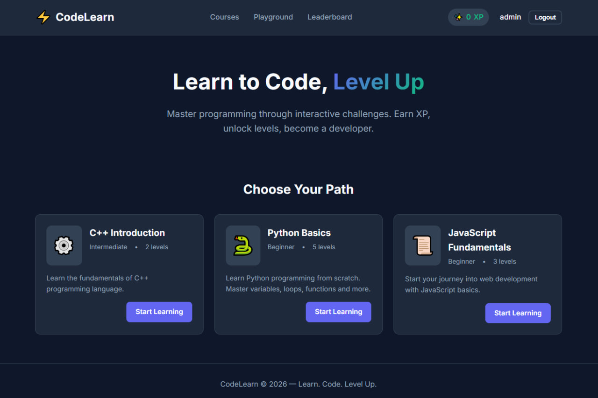
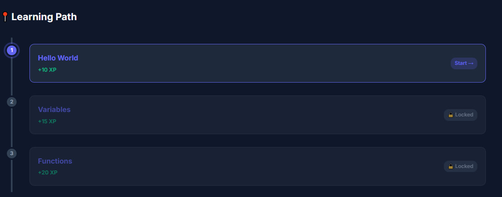
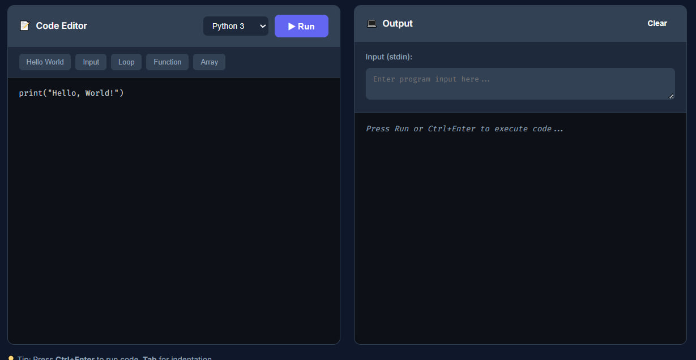
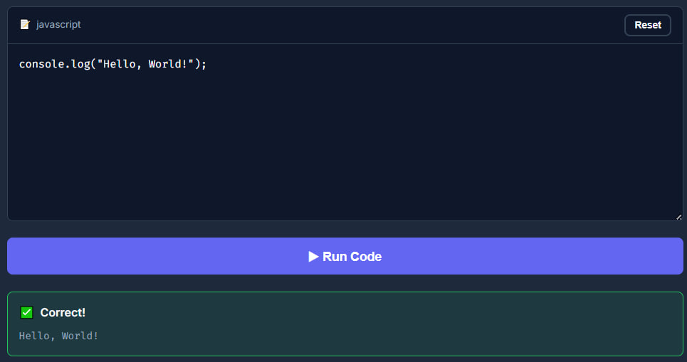
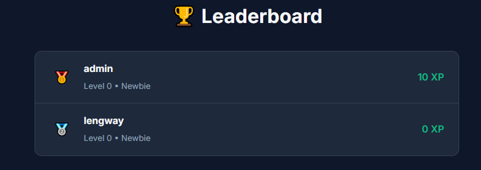
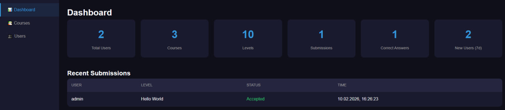

# CodeLearn - Online Programming Learning Platform

A platform for learning programming with automatic code checking via Piston.

## 📌 About the project

**Topic:** An interactive educational platform for learning programming with automatic code checking.

**Why we chose this project:**
The growth of Kazakhstan’s IT sector requires accessible, high‑quality learning tools. We built a platform that makes learning programming approachable and engaging with step‑by‑step lessons, hands‑on tasks, and instant feedback. This helps beginners build skills faster and contribute to the country’s technology ecosystem.

**Key features:**
- User registration and authentication (JWT)
- Courses with roadmap‑style levels
- Theory + practice tasks
- Automatic code checking via Piston
- XP and progress system
- Leaderboard
- Admin panel for content management

## 👥 Team

| Member | Role | Responsibilities |
|--------|------|------------------|
| **Roman Kutbeev** | Backend Developer | API, database, Piston integration, Docker |
| **Alibi Aibekuly** | Frontend Developer | UI/UX, client app, testing |

## 🚀 Quick start

### Requirements
- Docker & Docker Compose
- (Optional) Node.js 18+ for local development

### 🐳 Run with Docker (recommended)

```bash
# Start the full stack
docker-compose up -d

# Or use the script (PowerShell)
.\scripts\start.ps1
```

This will start:
- **PostgreSQL** (port 5432) - database
- **Piston** (port 2358) - code execution engine
- **Node.js App** (port 3000) - backend + frontend

After startup, the platform is available at **http://localhost:3000**

### Health checks

```bash
# Check container status
docker-compose ps

# Check API
curl http://localhost:3000/api/health

# Check Piston (available runtimes)
curl http://localhost:2358/api/v2/runtimes
```

### Stop

```bash
docker-compose down

# Full cleanup (remove volumes)
docker-compose down -v
```

---

## 💻 Local development (without Docker)

### Requirements
- Node.js 18+
- PostgreSQL 15+
- Piston (via Docker)

### Setup

1. **Install dependencies:**
```bash
npm install
```

2. **Configure environment:**
```bash
# Edit .env if needed
# DB_HOST=localhost
```

3. **Start PostgreSQL and Piston:**
```bash
# PostgreSQL
docker-compose up -d postgres

# Piston
docker-compose up -d piston piston-setup
```

4. **Initialize the database:**
```bash
npm run db:init
```

5. **Start the dev server:**
```bash
npm run dev
```

The server will be available at http://localhost:3000

---

## 📁 Project structure

```
├── src/
│   ├── config/          # Configuration (DB, JWT, Piston)
│   ├── controllers/     # Request handlers
│   ├── middleware/      # Auth, validation, errors
│   ├── repositories/    # SQL queries
│   ├── routes/          # API endpoints
│   ├── services/        # Business logic (code execution)
│   └── utils/           # Utilities
├── public/              # Frontend (HTML/CSS/JS)
├── database/            # SQL schemas and seed data
├── scripts/             # Start scripts
├── docker-compose.yml   # Docker configuration
└── package.json
```

## 🔌 API Endpoints

### Auth (Public)
- `POST /api/auth/register` - Register a new user with encrypted password
- `POST /api/auth/login` - Authenticate user and return JWT token
- `GET /api/auth/me` - Get current authenticated user

### Users (Private)
- `GET /api/users/profile` - Retrieve logged‑in user's profile
- `PUT /api/users/profile` - Update profile (email, username, etc.)
- `GET /api/users/progress` - Get user progress and statistics
- `GET /api/users/leaderboard` - Get global leaderboard

### Courses (Private)
- `GET /api/courses` - List all available courses
- `GET /api/courses/:id` - Get course details with levels
- `POST /api/courses/:id/start` - Enroll in a course

### Levels (Private)
- `GET /api/levels/:id` - Get level details with challenges

### Submissions (Private)
- `POST /api/submissions` - Submit code for checking
- `GET /api/submissions/:token` - Get submission result
- `GET /api/submissions/languages` - List available programming languages

### Admin (Private, Admin‑only)
- `POST /api/admin/courses` - Create new course
- `PUT /api/admin/courses/:id` - Update course
- `DELETE /api/admin/courses/:id` - Delete course
- `POST /api/admin/levels` - Create new level
- `PUT /api/admin/levels/:id` - Update level
- `DELETE /api/admin/levels/:id` - Delete level

## 🎮 Functionality

- ✅ Registration and authentication (JWT)
- ✅ Roadmap‑style courses and levels
- ✅ Theory + practice tasks
- ✅ Automatic code checking via Piston
- ✅ XP and level system
- ✅ User progress
- ✅ Leaderboard

## 🔧 Configuration

Environment variables (.env):

```env
PORT=3000
NODE_ENV=development

# Database
DB_HOST=localhost
DB_PORT=5432
DB_NAME=codelearn
DB_USER=postgres
DB_PASSWORD=postgres

# JWT
JWT_SECRET=your-secret-key
JWT_EXPIRES_IN=7d
```

## 🛡️ Security

- Passwords are hashed with bcrypt
- JWT tokens for authentication (7‑day expiry)
- Protected routes with authentication middleware
- Helmet for HTTP headers security
- CORS configured for cross‑origin requests
- Input validation with middleware
- Role‑based access control (RBAC) for admin features

---

## 📸 Screenshots

### 1. Landing and Course Selection Page
Clean and modern landing page introducing the platform with call‑to‑action buttons for registration and login.


### 2. Interactive Roadmap
Visual roadmap showing course progression with locked/unlocked levels. Each level displays completion status and XP earned.


### 3. Code Editor & Challenge
Integrated code editor with syntax highlighting supporting multiple programming languages. Users can write, test, and submit code directly in the browser.


### 4. Instant Feedback
Automatic code execution via Piston engine provides immediate test results, showing passed/failed test cases with detailed output.


### 5. Leaderboard
Competitive leaderboard displaying top performers based on XP earned, encouraging friendly competition among learners.


### 6. Admin Panel
Comprehensive admin dashboard for managing courses, levels, challenges, and monitoring user activity.


## 📋 Requirements Compliance

### ✅ Implemented Features:

**1. Project Setup (10 points)**
- ✅ Topic: Interactive programming learning platform
- ✅ Node.js & Express backend
- ✅ Modular structure (routes, controllers, middleware, services, repositories)
- ✅ README with setup, overview, API docs, and screenshots

**2. Database (10 points)**
- ✅ Two main collections: Users and Courses/Levels
- ⚠️ **Note:** Uses PostgreSQL instead of MongoDB for better relational data handling (users ↔ courses ↔ levels ↔ submissions). PostgreSQL provides superior referential integrity and complex query support essential for educational progress tracking.

**3. API Endpoints (20 points)**
- ✅ POST /api/auth/register (encrypted passwords)
- ✅ POST /api/auth/login (JWT tokens)
- ✅ GET /api/users/profile
- ✅ PUT /api/users/profile
- ✅ POST /api/submissions (create resource)
- ✅ GET /api/submissions (list resources)
- ✅ GET /api/levels/:id (get specific resource)
- ✅ PUT /api/submissions/:id (update resource)
- ✅ DELETE /api/admin/courses/:id (delete resource)

**4. Authentication & Security (15 points)**
- ✅ JWT for authentication
- ✅ Protected endpoints with middleware
- ✅ bcrypt for password hashing

**5. Validation & Error Handling (5 points)**
- ✅ Input validation middleware
- ✅ Appropriate error codes (400, 401, 404, 500)
- ✅ Global error handling middleware

**6. Deployment (10 points)**
- ✅ Environment variables for sensitive data
- ✅ Docker‑ready with docker‑compose.yml
- 🔄 Ready for Render/Railway/Replit deployment

**7. Advanced Features**
- ✅ **RBAC (5 points):** Admin role with elevated permissions for content management
- ❌ **SMTP Email Service (5 points):** Not implemented

**Total:** 65/70 points (without SMTP)

---

## 🔮 Future Enhancements

- Email notifications (SMTP integration via Nodemailer)
- Social authentication (Google, GitHub OAuth)
- Code collaboration features
- Video tutorials integration
- Certificate generation upon course completion
- Discussion forums for each level

## 📂 File tree (key paths)

```
├── database
│   ├── init.js
│   ├── schema.sql
│   └── seed.sql
├── docs
│   ├── ARCHITECTURE.md
│   ├── Backend Final Project Requirements.pdf
│   └── Final Project Draft (1).pdf
├── public
│   ├── css
│   ├── js
│   ├── admin.html
│   ├── course.html
│   ├── index.html
│   ├── leaderboard.html
│   ├── level.html
│   ├── login.html
│   └── register.html
├── scripts
│   ├── start.ps1
│   └── start.sh
├── src
│   ├── config
│   │   ├── database.js
│   │   ├── jwt.js
│   │   └── piston.js
│   ├── controllers
│   ├── middleware
│   ├── repositories
│   ├── routes
│   ├── services
│   ├── utils
│   ├── app.js
│   └── server.js
├── .env.example
├── Dockerfile
├── docker-compose.yml
└── package.json
```